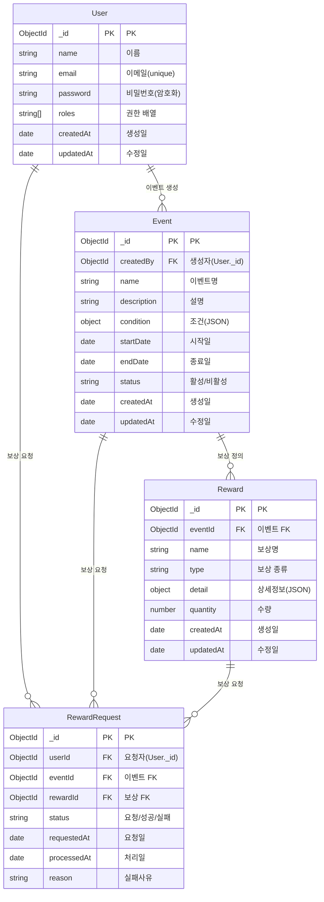

```mermaid
erDiagram

    User {
        ObjectId _id PK "PK"
        string name "이름"
        string email "이메일(unique)"
        string password "비밀번호(암호화)"
        string[] roles "권한 배열"
        date createdAt "생성일"
        date updatedAt "수정일"
    }

    Event {
        ObjectId _id PK "PK"
        ObjectId createdBy FK "생성자(User._id)"
        string name "이벤트명"
        string description "설명"
        object condition "조건(JSON)"
        date startDate "시작일"
        date endDate "종료일"
        string status "활성/비활성"
        date createdAt "생성일"
        date updatedAt "수정일"
    }

    Reward {
        ObjectId _id PK "PK"
        ObjectId eventId FK "이벤트 FK"
        string name "보상명"
        string type "보상 종류"
        object detail "상세정보(JSON)"
        number quantity "수량"
        date createdAt "생성일"
        date updatedAt "수정일"
    }

    RewardRequest {
        ObjectId _id PK "PK"
        ObjectId userId FK "요청자(User._id)"
        ObjectId eventId FK "이벤트 FK"
        ObjectId rewardId FK "보상 FK"
        string status "요청/성공/실패"
        date requestedAt "요청일"
        date processedAt "처리일"
        string reason "실패사유"
    }

    %% 관계 정의
    User ||--o{ Event : "이벤트 생성"
    User ||--o{ RewardRequest : "보상 요청"
    Event ||--o{ Reward : "보상 정의"
    Event ||--o{ RewardRequest : "보상 요청"
    Reward ||--o{ RewardRequest : "보상 요청"
```